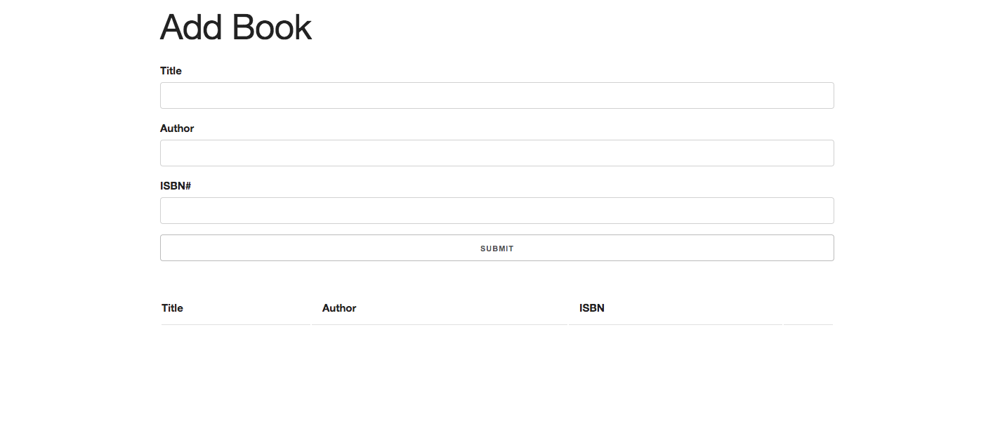
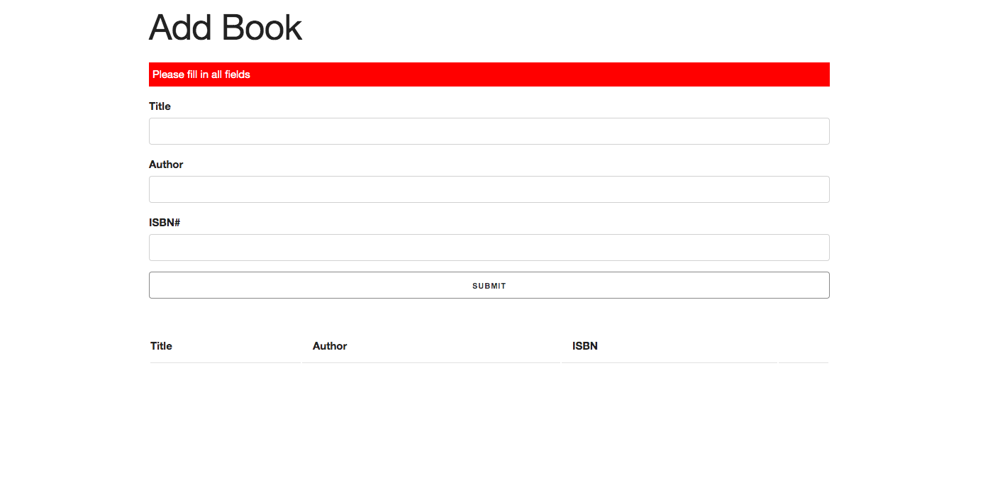
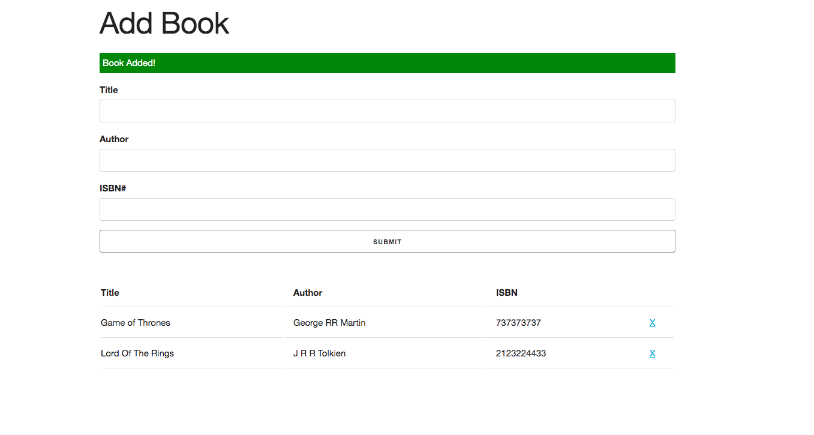
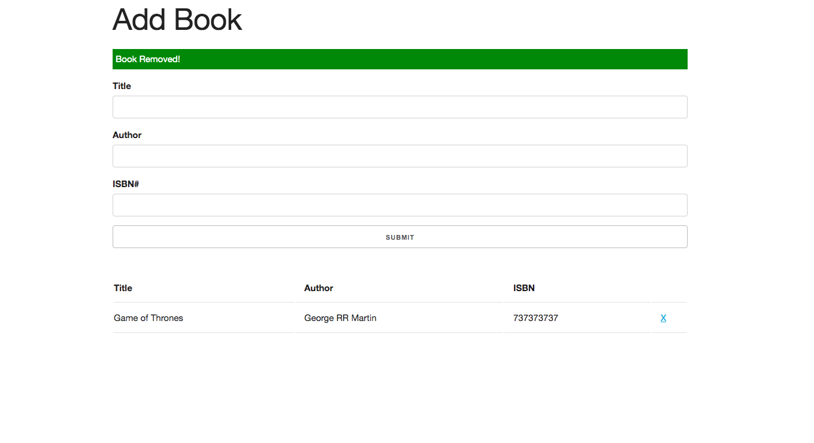

# OOP-Book-List

## Application  description:

The user is able to add and remove books from their book list application. A brief timed message will be displyed detailing the users interaction with the page if they put in the correct values, added a book, and removed a book. Books will be saved into local storage.

 ## Click [here]( https://brianlevin.github.io/OOP-Book-List/) for the live app. 
 
 This is the home screen:
 
 
  
  
  Correct values must be displayed on page otherwise they will get an error:
  
  
  
   A list and a brief message will be displayed  and added if the user types in the correct values:
   
    
   
   The user can also remove any books they added by clicking the delete button and brief message will be displayed:
   
   
   
   ## Libraries and Frameworks:

- HTML
- CSS
- Javascript

## Email:

bml201095@gmail.com

